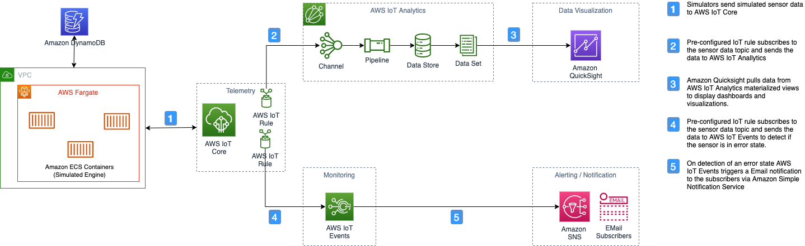

# Deprecation Notice
This AWS Solution has been archived; it is no longer being maintained by AWS. To discover other solutions for IoT operations on AWS, please visit [IoT on the Solutions Library](https://aws.amazon.com/solutions/iot/).

# Remote Monitoring of IoT Devices
IoT devices tend to have intermittent connectivity to the cloud. Furthermore, many devices are battery powered and can stop sending data to the cloud when they run out of charge. It is imperative to monitor these devices for data transmission, and data validity. Remotely monitoring assets is necessary to generate outcome-oriented insights from IoT solutions, whether it's based on telemetry data generated by a few devices in a smart home setting, or sensor-based data streaming off thousands of industrial devices. 
This solution ingests real-time device data from IoT devices to assess the state of each IoT device and send you notifications if there are data transmission /validity issues.

The solution provides a framework for collecting diagnostic information for deriving outcome-
oriented insights into the health of your assets. The solution utilizes a managed service to collect, analyze and detect faults and/or sub-optimal performance to generate events in real-time. These events are then used to invoke automatic alerts and actions to automate diagnostics and initiate maintenance requests for that device. 

For a detailed solution deployment guide, refer to [Remote Monitoring of IoT Devices](https://aws.amazon.com/solutions/implementations/remote-monitoring-of-iot-devices)

## On this Page

-   [Architecture Overview](#architecture-overview)
-   [Deployment](#deployment)
-   [Source Code](#source-code)
-   [Creating a custom build](#creating-a-custom-build)

## Architecture Overview
Deploying this solution with the required parameters builds the following environment in the AWS
Cloud.



The architecture of the solution includes the following key components.

[AWS IoT Core](https://docs.aws.amazon.com/iot/latest/developerguide/what-is-aws-iot.html) provides authentication and end-to-end encryption throughout all points of the connection between your products and the AWS Cloud, ensuring that the data is never exchanged without proven identity and validation of granular permissions. Devices communicate with AWS IoT Core using a publication/subscription model. 

[AWS IoT Rules Engine](https://docs.aws.amazon.com/iot/latest/developerguide/iot-rules.html) evaluates, transforms, and delivers the message to the appropriate backend services based on defined rules. In remote monitoring solution the telemetry data is delivered to AWS IoT Events and to AWS IoT Analytics.

[AWS IoT Events](https://docs.aws.amazon.com/iotevents/latest/developerguide/what-is-iotevents.html) helps companies continuously monitor IoT devices by detecting failure or changes in operation and trigger alerts to respond when events occur. You can define conditional logic and states inside AWS IoT Events to evaluate incoming telemetry data to detect events in equipment or a process. [AWS IoT SiteWise](https://aws.amazon.com/iot-sitewise/?nc=sn&loc=2&dn=6) sends asset property values to AWS IoT Events to detect the alarm state. You can specify when the alarm detects and who should be notified when the alarm state changes. You can also define the AWS IoT Events actions that occur when the alarm state changes. Alarms in AWS IoT Events are instances of alarm models. The alarm model specifies the threshold and severity of the alarm, what to do when the alarm state changes, and more.

In this solution once a monitoring anomaly event is detected from the incoming telemetry data, alerts are sent through Amazon Simple Notification Service (SNS) to notify all subscribers.

[AWS IoT Analytics]() automates the process required to analyze data from Remote Monitoring of IoT Devices. It filters, transforms, and enriches the data this solution collects before storing the data in a time-series data store for analysis. You can apply transforms to process the data, and enrich the data with device-specific metadata such as device type and location before storing it. Then, you can analyze your data by running queries, or perform more complex analytics and machine learning inference.
You can also leverage [Amazon QuickSight](https://aws.amazon.com/quicksight/) to visualize the data that this solution collects.

[Amazon Elastic Container Service (Amazon ECS)](https://docs.aws.amazon.com/AmazonECS/latest/developerguide/Welcome.html) is a fully managed container orchestration service. The solution runs the simulated devices as containers deployed in an Amazon ECS Cluster.

## Deployment
This solution uses AWS CloudFormation to automate the deployment of the Remote Monitoring of IoT Devices in the AWS Cloud.

For details on deploying the solution please see the details on the solution home page: [Remote Monitoring of IoT Devices](https://aws.amazon.com/solutions/implementations/remote-monitoring-of-iot-devices)

## Source Code
The Remote Monitoring of IoT devices consist of:

* A simulation engine to generate device data
* IoT rules engine to send the data to AWS IoT Events and AWS IoT Analytics
* AWS IoT Events Detector Model to act on the data and send SNS notifications based on consecutive data exceeding threshold values or data not arriving for a set period of time
* AWS IoT Analytics to store the data so the user can create dashboards using Amazon Quicksight. 

```
|-deployment/
  |-build-s3-dist.sh                            [ shell script for packaging distribution assets ]
  |-run-unit-tests.sh                           [ shell script for executing unit tests ]
  |-build-open-source-dist.sh                   [ build the distribution files ]  
  |-remote-monitoring-of-iot-devices.yaml       [ solution CloudFormation deployment template ]
  |-ecr/
    |-remote-monitoring-of-iot-devices/
      |-lib/                                      [ Simulation engine libraries ]
```

***

## Creating a custom build
The solution can be deployed through the CloudFormation template available on the solution home page: [Remote Monitoring of IoT Devices](https://aws.amazon.com/solutions/implementations/remote-monitoring-of-iot-devices/). To make changes to the solution, using the below steps to download or clone this repo, update the source code and then run the deployment/build-s3-dist.sh script to deploy the updated code to your Amazon S3 bucket in your account.

### Running unit tests for customization
* Clone the repository, then make the desired code changes
* Next, run unit tests to make sure added customization passes the tests

```
cd ./deployment
chmod +x ./run-unit-tests.sh
./run-unit-tests.sh
```

### Building distributable for customization
* Configure the bucket name of your target Amazon S3 distribution bucket

```
export DIST_OUTPUT_BUCKET=my-bucket-name # bucket where customized code will reside
export SOLUTION_NAME=my-solution-name
export VERSION=my-version # version number for the customized code
```
-   When creating and using buckets it is recommended to:

    -   Use randomized names or uuid as part of your bucket naming strategy.
    -   Ensure buckets are not public.
    -   Verify bucket ownership prior to uploading templates or code artifacts.

-   Deploy the distributable to an Amazon S3 bucket in your account. _Note:_ you must have the AWS Command Line Interface installed.

* Now build the distributable:

```
chmod +x ./build-s3-dist.sh
./build-s3-dist.sh $DIST_OUTPUT_BUCKET $SOLUTION_NAME $VERSION
```

* Deploy the distributable to an Amazon S3 bucket in your account. _Note:_ you must have the AWS Command Line Interface installed.
```
aws s3 cp global-s3-assets/ s3://$DIST_OUTPUT_BUCKET/$SOLUTION_NAME/$VERSION/ --recursive
```

* Get the link of the solution template uploaded to your Amazon S3 bucket.
* Deploy the solution to your account by launching a new AWS CloudFormation stack using the link of the solution template in Amazon S3.

### Building the simulation engine Docker container for customization
The simulation engine is a Docker container that is powered by AWS Fargate. Amazon ECS containers provisioned by [AWS Fargate](https://docs.aws.amazon.com/AmazonECS/latest/developerguide/AWS_Fargate.html) contain the simulation engine that periodically polls a simulation queue for simulation requests. The simulation engine provides the logic for managing virtual devices and generating the simulated data to send to the target AWS IoT endpoint. After making your customization to the simulation engine, you will need build a new Docker image.

```
cd ecr/remote-monitoring-of-iot-devices
docker build -t <image-name> .
```

Note: To install the AWS CLI and Docker and for more information on the steps below, visit the ECR [documentation page](http://docs.aws.amazon.com/AmazonECR/latest/userguide/ECR_GetStarted.html).


---

Copyright 2020-2021 Amazon.com, Inc. or its affiliates. All Rights Reserved.

Licensed under the Apache License, Version 2.0 (the "License");
you may not use this file except in compliance with the License.
You may obtain a copy of the License at

    http://www.apache.org/licenses/LICENSE-2.0

Unless required by applicable law or agreed to in writing, software
distributed under the License is distributed on an "AS IS" BASIS,
WITHOUT WARRANTIES OR CONDITIONS OF ANY KIND, either express or implied.
See the License for the specific language governing permissions and
limitations under the License.
